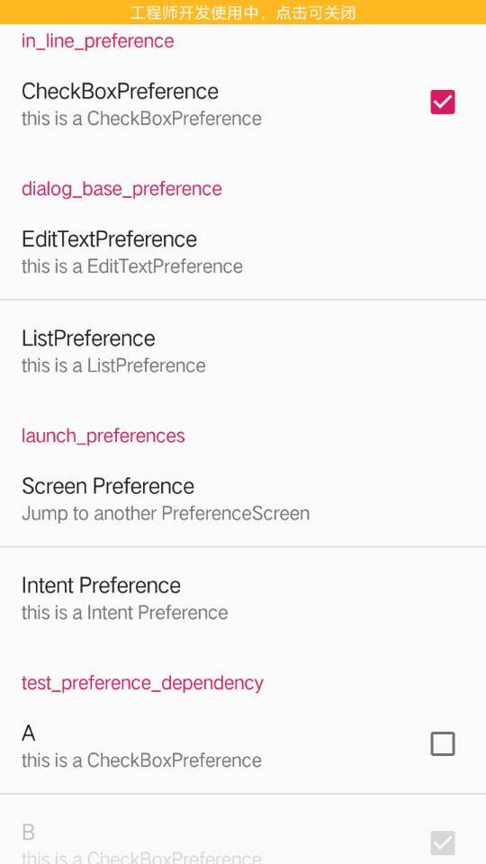

# 实验四_使用PrefereceFragment实现设置页面 

## 一、截图

## 二、代码地址

代码地址：https://github.com/jackstears/Setting_4/blob/master/app/src/main/java/com/example/myfirstapp/ex4

相应xml文件地址：https://github.com/jackstears/Setting_4/blob/master/app/src/main/res/xml/preferences_ex4.xml
